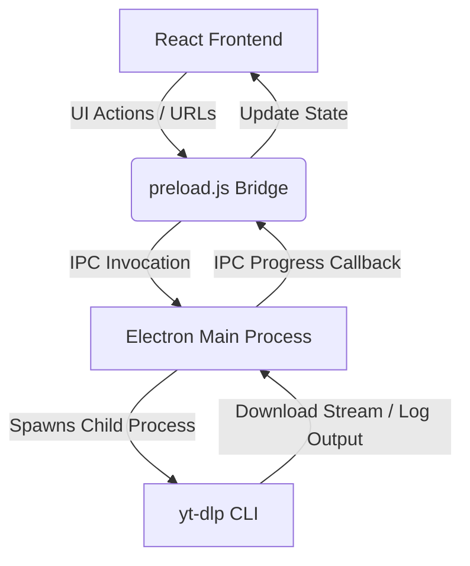

<div align="center">

# 📺 My-Tube

### *A Sleek, Modern Desktop YouTube Downloader Built on Electron & React*

[](https://vitejs.dev/)
[](https://react.dev/)
[](https://www.electronjs.org/)
[](https://github.com/yt-dlp/yt-dlp)
[](https://opensource.org/licenses/MIT)

<p align="center">
  A high-performance YouTube video and audio downloader for your desktop.
  Powered by the modern combination of <b>Vite</b>, <b>React</b>, and <b>Electron</b>, with <b>yt-dlp</b> running the heavy lifting in the background.
</p>

[✨ Features](#-features) • [⚙️ How It Works](#️-how-it-works) • [🚀 Quick Start](#-quick-start) • [📂 Project Structure](#-project-structure)

</div>

---

## ✨ Features

- **⚡ Easy Media Extraction**: Just paste any YouTube video or playlist URL and hit "Fetch" to load rich details.
- **📥 Format & Quality Control**:
  - Download high-definition video up to **1080p**.
  - Extract premium high-quality audio files (M4A and best quality formats).
- **📂 Playlist Downloader**: Batch-download entire playlists concurrently. It automatically adapts download speed/concurrency to optimize network bandwidth.
- **📈 Live Progress Updates**: See live percentage progress bars, download speed metrics, active output logs, and job statuses.
- **🕒 Download History**: Locally persist a list of completed or failed downloads with timestamps.
- **🛡️ Self-Healing Dependencies**: The backend automatically looks for `yt-dlp` on your system. If missing, it attempts to install it automatically using `pip3`.

---

## ⚙️ How It Works

My-Tube leverages Electron's secure architecture to separate the rendering frontend from the operating system backend.



### Key Components:
1. **Frontend UI (Renderer)**: Developed using React and styled with custom modern dark-theme CSS.
   - [App.jsx](file:///home/joejo/repos/my-tube/src/App.jsx) routes the application's tabs: Home, Queue, History, and Settings.
   - [AppContext.jsx](file:///home/joejo/repos/my-tube/src/context/AppContext.jsx) manages global state, including active queues and historical downloads.
   - User inputs are handled by [Home.jsx](file:///home/joejo/repos/my-tube/src/components/Home.jsx), which passes URLs to the downloader components:
     - [DownloaderCard.jsx](file:///home/joejo/repos/my-tube/src/components/DownloaderCard.jsx) for single videos.
     - [PlaylistCard.jsx](file:///home/joejo/repos/my-tube/src/components/PlaylistCard.jsx) for playlist batches.
2. **IPC Bridge**: Exposes system-level functions to React in a secure manner.
   - [preload.js](file:///home/joejo/repos/my-tube/src/preload.js) defines the `window.electronAPI` interface.
3. **OS Integration (Main Process)**:
   - [main.js](file:///home/joejo/repos/my-tube/src/main.js) initializes the application window and registers native API event listeners.
   - [downloader.js](file:///home/joejo/repos/my-tube/src/downloader.js) handles direct communication with `yt-dlp`. It spawns shell child-processes, reads terminal outputs, and reports live progress back to the renderer.

---

## 🚀 Quick Start

### Prerequisites
- [Node.js](https://nodejs.org/) (v18+)
- [Python 3](https://www.python.org/) with `pip` (required for automatic `yt-dlp` installation)
- [FFmpeg](https://ffmpeg.org/) (recommended for merging video and audio formats)

### Installation
1. Clone the repository and navigate to the directory:
   ```bash
   git clone https://github.com/callmejojoe/my-tube.git
   cd my-tube
   ```
2. Install npm dependencies:
   ```bash
   npm install
   ```

### Development
Launch the Electron application in hot-reloading development mode:
```bash
npm start
```

### Build & Package
Package the application into an executable:
```bash
npm run package
```
To generate installers for your target OS:
```bash
npm run make
```
Completed binaries will be outputted to the `out/` directory.

---

## 📂 Project Structure

- 📁 [src/](file:///home/joejo/repos/my-tube/src) — Application source code.
  - 📁 [components/](file:///home/joejo/repos/my-tube/src/components) — React UI components.
    - 📄 [Home.jsx](file:///home/joejo/repos/my-tube/src/components/Home.jsx) — URL fetching and card rendering dashboard.
    - 📄 [Sidebar.jsx](file:///home/joejo/repos/my-tube/src/components/Sidebar.jsx) — Sidebar navigation.
    - 📄 [DownloaderCard.jsx](file:///home/joejo/repos/my-tube/src/components/DownloaderCard.jsx) — Single video downloader.
    - 📄 [PlaylistCard.jsx](file:///home/joejo/repos/my-tube/src/components/PlaylistCard.jsx) — Playlist downloader.
    - 📄 [Queue.jsx](file:///home/joejo/repos/my-tube/src/components/Queue.jsx) — View active concurrent download progress.
    - 📄 [History.jsx](file:///home/joejo/repos/my-tube/src/components/History.jsx) — Download log with clean status flags.
    - 📄 [Settings.jsx](file:///home/joejo/repos/my-tube/src/components/Settings.jsx) — Application settings.
  - 📁 [context/](file:///home/joejo/repos/my-tube/src/context) — Context providers.
    - 📄 [AppContext.jsx](file:///home/joejo/repos/my-tube/src/context/AppContext.jsx) — Global state engine.
  - 📄 [main.js](file:///home/joejo/repos/my-tube/src/main.js) — Electron main entry point.
  - 📄 [preload.js](file:///home/joejo/repos/my-tube/src/preload.js) — IPC Context Bridge.
  - 📄 [downloader.js](file:///home/joejo/repos/my-tube/src/downloader.js) — Spawns and manages `yt-dlp` processes.
  - 📄 [index.css](file:///home/joejo/repos/my-tube/src/index.css) — Custom premium styles.
- 📄 [package.json](file:///home/joejo/repos/my-tube/package.json) — Node.js manifest and scripts.
- 📄 [forge.config.js](file:///home/joejo/repos/my-tube/forge.config.js) — Electron Forge packaging configuration.

---

## 📄 License
This project is licensed under the MIT License. See [package.json](file:///home/joejo/repos/my-tube/package.json) for details.
